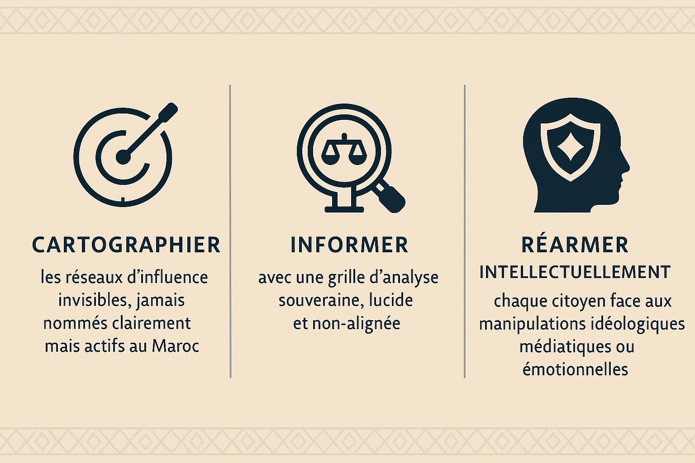

<section class="section" dir="rtl">
  <h2>علاش هد المشروع؟</h2>
  
كاين فايك نيوز وحدة اللي كانت زايدة بزاف.

  
هي اللي خرجات الآلاف من المغاربة للزنقة، وهم ما عارفينش أنهم متحكم فيهم بسرد خارجي، باش يضربو واحد من أعمدة السيادة الاقتصادية ديالنا: <strong>طنجة ميد</strong>.

  
حملة كذوب مدروسة مزيان، كتنشرها قناة أجنبية اللي دايماً كتستغل العواطف الجماعية باش تدفع بأجندتها في المنطقة.

  
فهاد الجو ديال التضليل والمنابر الوطنية اللي نايمة، تزاد <strong>Ribat Intelligence</strong>.

  
حارس سيادي. قلعة فكرية. خلية ضد التأثيرات الأجنبية.

  
ما كناخدو حتى دعم من برا. ما تابعين حتى حزب. ما خدامينش بأي إيديولوجيا مستوردة.

  
<strong>الجهة اللي حنا فيها واضحة: المغرب اللي فايق، حر، وماشي تابع لحد.</strong>

</section>

<section class="section" dir="rtl">
  <h2>المهمة الثلاثية ديالنا</h2>
  
</section>
